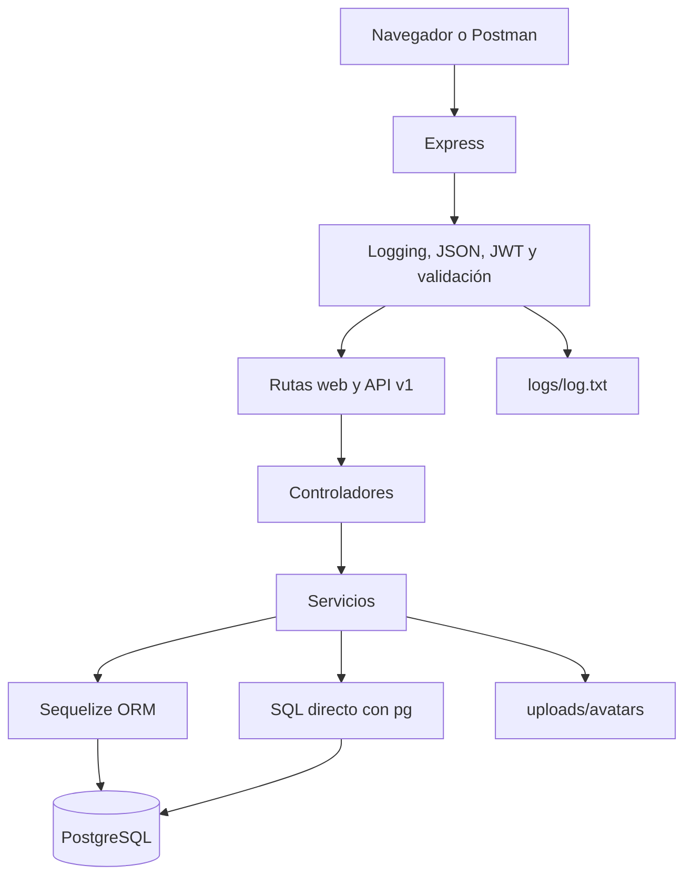
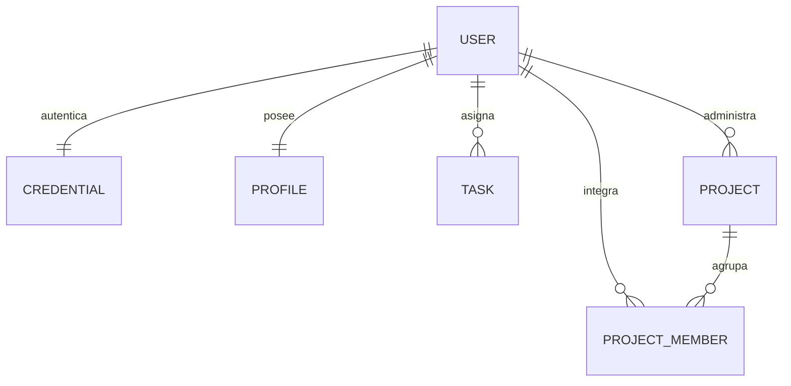

# Flujo cliente, API y base de datos

## Arquitectura modular

Las rutas definen método, URL y middlewares. Los controladores coordinan la solicitud y la respuesta. Los servicios aplican reglas de negocio y persistencia. Así la seguridad y el transporte HTTP no quedan mezclados con las consultas.

## Relaciones del Módulo 8

- `User–Credential` y `User–Profile`: 1:1 mediante `user_id UNIQUE`.
- `User–Task`: 1:N; cada tarea tiene un responsable.
- `User–Project`: N:M mediante la clave compuesta de `project_members`.
- `User–Project` como propietario: 1:N para autorizar cambios.

## Registro e inicio de sesión

1. `POST /api/v1/auth/register` valida nombre, correo, contraseña y biografía.
2. bcrypt genera el hash; una transacción crea usuario, credencial y perfil.
3. `POST /api/v1/auth/login` compara la contraseña con el hash.
4. El servicio firma un JWT HS256 con identidad, rol, emisor, audiencia y expiración.
5. El cliente envía `Authorization: Bearer <token>` en cada ruta privada.
6. El middleware valida el token y carga el usuario activo antes del controlador.

Un token ausente, alterado o expirado responde `401`. Un usuario autenticado que intenta modificar datos ajenos recibe `403`.

## Carga de avatar

1. `POST /api/v1/upload` exige autenticación.
2. Multer recibe un único campo `file` en memoria y limita su tamaño.
3. El middleware restringe el MIME a JPEG, PNG o WEBP.
4. El servicio comprueba la firma binaria antes de escribir.
5. El archivo recibe un UUID y se guarda en `uploads/avatars`.
6. `profiles.avatar_url` queda asociado al usuario autenticado.
7. Express sirve la imagen mediante `/uploads/avatars/<archivo>`.

## Consultas y transacciones heredadas

- La API usa Sequelize para CRUD y relaciones mediante `include`.
- Las rutas del Módulo 7 conservan una consulta SQL parametrizada con `pg` para comparar resultados.
- `POST /transacciones/usuario-tarea` conserva la demostración de commit y rollback.
- Cada solicitud sigue agregando una línea a `logs/log.txt`, manteniendo la persistencia plana del Módulo 6.

Todos los controladores JSON responden con `{ status, message, data }`. El middleware central convierte validaciones, duplicados, autorización, archivos y problemas de conexión en códigos HTTP controlados.
