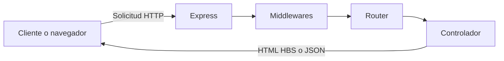

# Flujo básico cliente-servidor

## Node.js y Express

Node.js permite ejecutar JavaScript fuera del navegador y ofrece módulos como `http`, `fs` y `path`. Es apropiado para servidores orientados a eventos y operaciones de entrada/salida.

Express se ejecuta sobre Node.js y simplifica el servidor HTTP mediante rutas, middlewares, respuestas y configuración de archivos estáticos. En este proyecto, Express organiza el flujo sin reemplazar las capacidades nativas de Node: el módulo `fs`, por ejemplo, sigue siendo responsable de escribir `logs/log.txt`.

## Ecosistema usado en esta parte

- `express`: servidor web, rutas y middlewares.
- `hbs`: renderizado de la vista dinámica.
- `dotenv`: variables de entorno.
- `nodemon`: reinicio automático durante el desarrollo.
- Módulos nativos `fs` y `path`: archivos y rutas del sistema.
