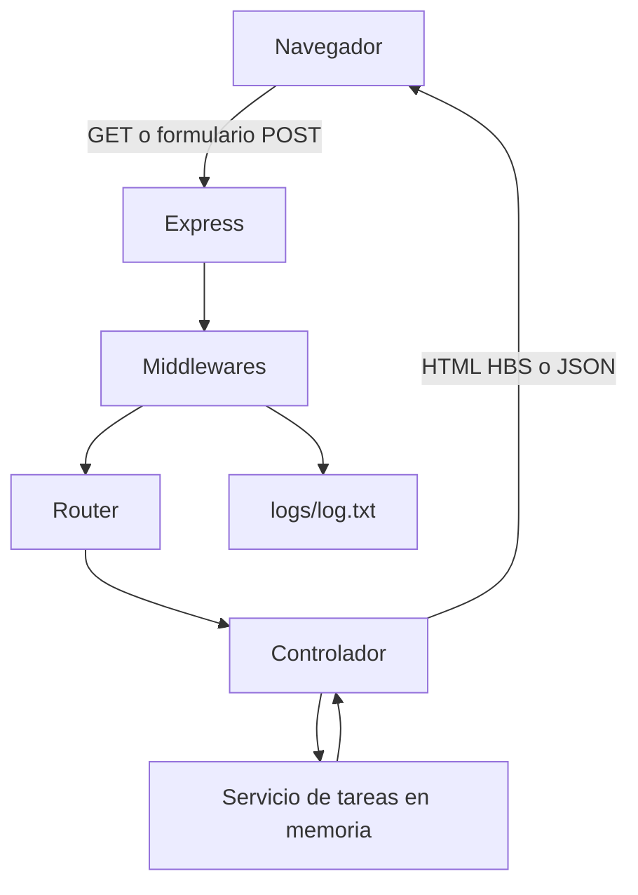

# Flujo básico cliente-servidor

## Funcionamiento actual

La ruta `/` pide las tareas al servicio `task.service.js` y las entrega a HBS. La vista utiliza Bootstrap instalado con npm y una hoja CSS pequeña para mostrar el formulario, el resumen, los filtros y la lista de tareas.

Los formularios permiten crear, avanzar y eliminar tareas. Express procesa esos datos con `express.urlencoded()`, el controlador coordina la operación y el servicio modifica un arreglo en memoria. Por eso los cambios se conservan mientras el servidor está encendido, pero se reinician al detenerlo.

La ruta `/api/tasks` expone el mismo listado en JSON. En el Módulo 7, el servicio podrá reemplazar el arreglo por consultas a una base de datos sin rehacer la interfaz ni las rutas principales.

Cuando la ruta solicitada no está registrada, el middleware 404 envía el error al manejador central. Las rutas web muestran `not-found.hbs` con un enlace de regreso al tablero, mientras que las rutas que comienzan con `/api/` conservan una respuesta JSON.

## Herramientas utilizadas

- `express`: servidor, rutas, formularios y middlewares.
- `hbs`: vista dinámica.
- `bootstrap`: componentes y diseño responsive.
- `dotenv`: variables de entorno.
- `nodemon`: reinicio automático durante el desarrollo.
- `fs`: escritura de accesos en `logs/log.txt`.
- `node:test`: pruebas automáticas.
