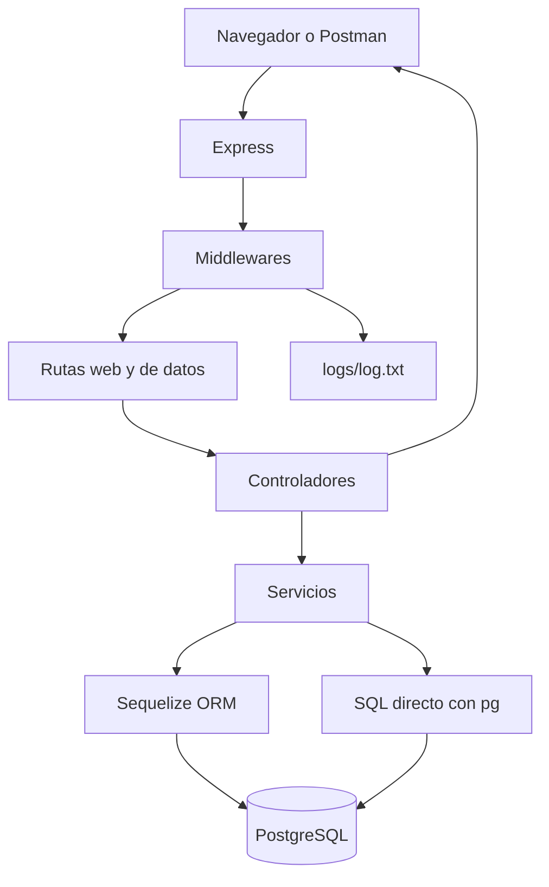
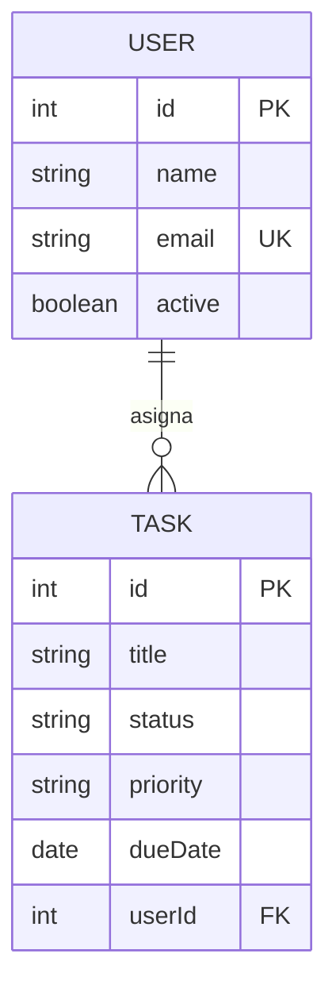

# Flujo cliente, servidor y base de datos

## Modelos y relación

Un usuario puede tener ninguna o muchas tareas. Cada tarea debe tener exactamente un responsable. La clave foránea `tasks.user_id` referencia `users.id` y utiliza eliminación en cascada.

## Flujo ORM

1. La ruta recibe parámetros o un cuerpo JSON.
2. El controlador delega la operación al servicio.
3. El servicio valida IDs, textos, correos, fechas y valores permitidos.
4. Sequelize consulta o modifica PostgreSQL mediante los modelos.
5. El controlador responde con `{ status, message, data }`.
6. El middleware central transforma errores de validación, duplicados y conexiones.

## SQL directo versus Sequelize

- `GET /usuarios` utiliza `User.findAll()` de Sequelize.
- `GET /usuarios/sql` ejecuta un `SELECT` parametrizado mediante el paquete `pg`.
- `GET /usuarios/comparacion` ejecuta ambos métodos y confirma si entregan los mismos campos públicos.

El SQL directo permite observar con precisión la consulta ejecutada. Sequelize evita repetir sentencias CRUD, concentra validaciones en modelos y facilita relaciones mediante `include`.

## Consulta de relaciones

`GET /usuarios/:id/tareas` utiliza `include` para devolver un usuario junto con sus tareas en una respuesta anidada. No se devuelven contraseñas porque TaskFlow todavía no maneja credenciales; esa capacidad se agregará con autenticación en el Módulo 8.

## Transacción

`POST /transacciones/usuario-tarea` ejecuta dos acciones consecutivas:

1. Crear un usuario.
2. Crear su primera tarea.

Ambas se ejecutan dentro de `sequelize.transaction()`. Si la tarea falla o se envía `forceFailure: true`, Sequelize realiza rollback y tampoco conserva el usuario. El servidor registra en consola si la transacción terminó correctamente o fue revertida.

## Persistencia del Módulo 6

El middleware de accesos se conserva. Cada solicitud agrega una línea a `logs/log.txt` mediante `fs.appendFile()`, independientemente de la persistencia principal en PostgreSQL.
